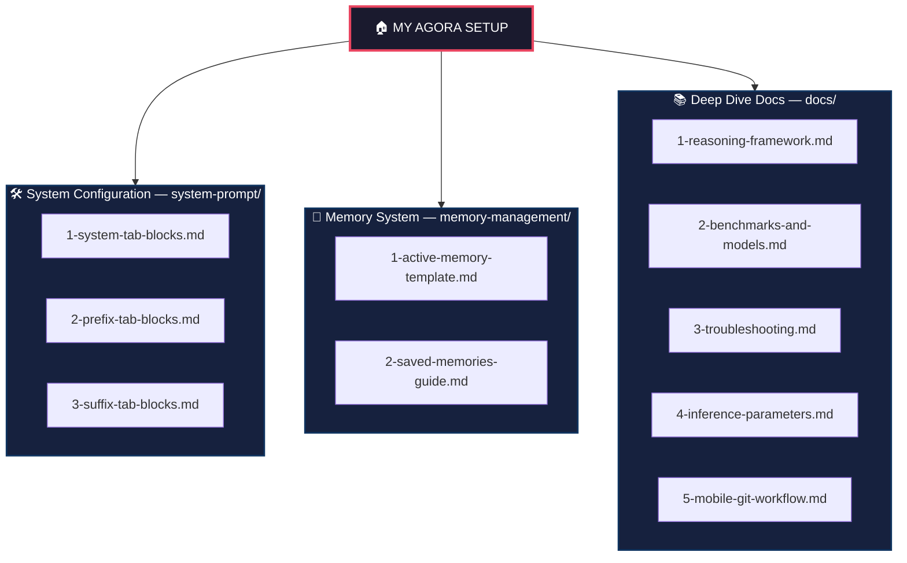

# 📱 Agora App – My Pro Setup for Autonomous AI Agents

Welcome to my personal configuration guide for [**Agora**](https://github.com/newo-ether/Agora) (the premier open-source AI agent app on F-Droid). 

Executing complex workflows on a mobile device—like analyzing server logs, conducting multi-step web research, or managing projects—requires more than just a simple chatbot. It requires a **truly autonomous AI agent** that plans, uses tools, and operates with zero hallucinations.

I built this repository to share my battle-tested setup. It natively utilizes Agora's UI block system and is optimized specifically for token efficiency, fast mobile streaming, and high-reliability tool-calling.

---

## 🗺️ Repository Map & Architecture



---

## 💡 Real-World Example: Why You Need This

To understand the difference between a standard "chatbot" and this
**Autonomous Agent Setup**, here is a real situation I handled
directly from my phone while returning from a short vacation abroad:

**The Situation:** I was traveling on an international express train
from one EU country to another, and had a very tight transfer window
— under 5 minutes — for my next regional connection at a border
station. I needed to know whether the regional train would wait for
me in case of a delay, and what my realistic backup options were if
I missed it.

**How My Agent Handled It (MiniMax M3):**
1. **Zero Hallucination & Nuance:** Instead of guessing, it
   autonomously executed multiple verification calls in seconds. It
   checked the current timetable and connection rules across
   operators, explicitly noting that the connection was **not
   contractually guaranteed** in the official schedule — while
   accurately pointing out that onboard staff or dispatch often
   request regional trains to hold for delayed international
   services in practice. Both facts delivered in one answer.
2. **Context Awareness:** When I corrected my departure time
   mid-conversation, the agent instantly recalculated my exact
   timeline and upcoming milestones along the route — border
   crossing, transfer point, final destination — without breaking
   flow.
3. **Problem Solving:** When I asked what my fallback would be if
   the connection didn't hold, it laid out the exact local backup
   (a regional train about 1 hour 15 minutes later), provided
   realistic arrival times, and advised me to use the local
   national rail app for live tracking upon arrival at the transfer
   station.

I got a complete, verified logistical rescue plan while sitting on
a moving international train. **This is what a mobile AI Dev-Ops
& Life assistant looks like.**

---

## 💡 Another Real-World Example: Full GitHub Push from a Phone

This second example shows the same setup applied to a **tighter constraint: only my phone, no laptop, no local shell** — and a 10-file documentation push as the target.

**The Situation:** I needed to populate `painter99/agora-pro-setup` with the complete Agora reference set (system-prompt block layouts, memory templates, deep-dive docs) so my agent has the full material at hand. The sandbox was a vanilla Alpine image — no git, no openssh, no SSH keys. **Constraint:** I refused to open a laptop. The whole pipeline had to run through a chat from my phone.

**How my agent handled it (≈15 min, ~6 round-trips):**

1. **Zero-touch bootstrap:** From the chat, the agent ran `apk update && apk add git openssh`, generated an `ed25519` SSH key, wrote `~/.ssh/config`, and added GitHub to `known_hosts` via `ssh-keyscan` — all in parallel batches.
2. **Self-aware halt:** After the first `git clone` failed with `Permission denied (publickey)`, the agent **stopped**, diagnosed the cause (key not yet on my GitHub account), and waited. Once I pasted the key into GitHub and replied "run the clone again," the retry succeeded instantly.
3. **Branch-and-review discipline:** Before touching `main`, the agent created `edit-2026-07-27`, staged all 10 files, and produced a full diff stat for me to inspect. It only pushed to that branch — never to `main` — and asked for explicit "GO" before every push.
4. **Atomic batch writes:** All 10 files were written in a single parallel tool-call batch, then committed as one logical change (`f23fbf7`).
5. **Merge with history preserved:** After I confirmed the diff was right, the agent ran `git merge --no-ff edit-2026-07-27` and pushed `main` with a clean merge commit (`3bbbb96`).

**Result:** A complete repository documented hands-free, from a phone, in 15 minutes. The repo is now a living reference — and the workflow that built it is documented here as proof.

See the full breakdown in [`docs/5-mobile-git-workflow.md`](docs/5-mobile-git-workflow.md).

---

## 🚀 Quick Start (4 Steps)

1. **Configure Prompt Blocks:** Open Agora → Edit System Prompt. Follow my exact block-by-block layout in [`system-prompt/1-system-tab-blocks.md`](system-prompt/1-system-tab-blocks.md).
2. **Setup Time-Awareness:** Configure the Prefix and Suffix tabs using [`system-prompt/2-prefix-tab-blocks.md`](system-prompt/2-prefix-tab-blocks.md) and [`system-prompt/3-suffix-tab-blocks.md`](system-prompt/3-suffix-tab-blocks.md).
3. **Set Up Your Workbench:** Fill in your Active Memory using my template in [`memory-management/1-active-memory-template.md`](memory-management/1-active-memory-template.md).
4. **Tune Inference Parameters:** Set sampling values in Agora's model settings — see my recommended config in [`docs/4-inference-parameters.md`](docs/4-inference-parameters.md).

---

## ⚖️ My Dual-Model Strategy & A/B Testing

For optimal results in Agora, I use a **Dual-Model Strategy**. Depending on the task, I switch between these two top-tier models to get the best balance of speed, cost, and specialized capabilities.

```text
+-------------------------------------------------------------------------+
|                         MY RECOMMENDED SETUP                            |
+------------------------------------+------------------------------------+
|   🥇 MiniMax M3 (Primary Engine)   |  🥈 Qwen 3.7 Plus (A/B & Vision)  |
|   • Daily workhorse & general chat |  • Multimodal / Screenshot analysis|
|   • Lightning fast (80 tok/s)      |  • Terminal & CLI heavy tasks      |
|   • ~25% cheaper API cost          |  • A/B testing reference model     |
+------------------------------------+------------------------------------+
```

### Verified Benchmark Comparison

| Metric / Feature | 🥇 MiniMax M3 (My Primary) | 🥈 Qwen 3.7 Plus (My Alternative) | Winner / Advantage |
| :--- | :--- | :--- | :--- |
| **MCP Atlas (Tool Use)** | **74.2%** | 73.2% | **MiniMax M3** (+1.0%) |
| **Output Speed** | **~80 tok/s** | ~54 tok/s | **MiniMax M3** (+48% faster) |
| **Time To First Token** | **1.62s** | 2.87s | **MiniMax M3** (77% faster TTFT) |
| **Average Pricing (1M)** | **$0.24 in / $0.96 out** | $0.32 in / $1.28 out | **MiniMax M3** (~25% cheaper) |
| **SWE-Bench Verified** | **80.5%** | 77.7% | **MiniMax M3** (+2.8%) |
| **Terminal-Bench 2.0** | 66.0% | **70.3%** | **Qwen 3.7 Plus** (+4.3%) |
| **Vision & Image Input** | Basic | **Native Multi-image & Video** | **Qwen 3.7 Plus** (Vision Specialist) |
| **Large Context Decode** | **Ultra-fast (MSA)** | Standard Attention | **MiniMax M3** (15x faster on large context) |
| **Licensing** | **Open-Weight** | Proprietary API | **MiniMax M3** (Self-hostable) |

### ⚙️ My Default Sampling Config

| Thinking Budget | Output Budget | Temperature | TopP |
| :---: | :---: | :---: | :---: |
| 2048 tok | 8192 tok | 0.5–0.7 | 0.95 |

*(Full reasoning per parameter → [`docs/4-inference-parameters.md`](docs/4-inference-parameters.md))*

---

### When I use which in Agora:

* **I use MiniMax M3 for 90% of my daily tasks:** It is significantly faster on my phone, cheaper, handles long context decode effortlessly via MiniMax Sparse Attention (MSA), and delivers exceptional multilingual performance.
* **I switch to Qwen 3.7 Plus when:** I need to feed screenshots or UI mockups to my agent, or when I am executing complex CLI/Terminal workflows. *Note: Qwen 3.7 Plus uses standard attention, so processing very large context windows feels noticeably slower than MiniMax M3.*

*(Read my complete deep-dive on why I chose these two models in [`docs/2-benchmarks-and-models.md`](docs/2-benchmarks-and-models.md)).*
