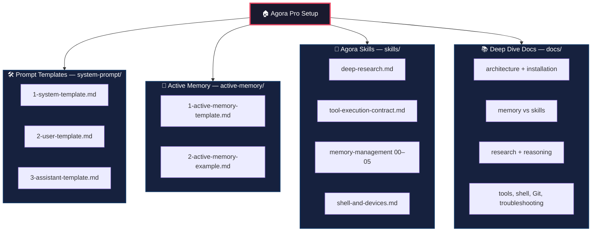

# 📱 Agora Pro Setup

A public collection of reusable **prompt templates**, **Active Memory** patterns, **Agora Skills**, and operational documentation for the [Agora](https://github.com/newo-ether/Agora) AI application.

This repository is **not** the Agora app. Agora is developed separately. This project is a generic, anonymized configuration kit for building a compact, memory-aware, tool-using assistant.

---

## 🗺️ Repository Map & Architecture



---

## ⚙️ Current Agora runtime

Agora no longer uses **System + Prefix + Suffix**. The prompt editor now has three templates:

```text
System       complete provider-visible system message
User         structure around each ordinary user message
Assistant    structure around each ordinary assistant message
```

The **User** and **Assistant** templates each contain exactly one structural **Prompt** item (`{prompt}`). You may add text and variables around it.

Date and time belong in the **User** template via `{sent_date}` and `{sent_time}` — not in Prefix/Suffix tabs.

The System template should explicitly include:

```text
{active_memory}
{skill_catalog}
```

Agora does **not** silently append hidden memory or Skill text. If a variable is missing from the template, it will not appear.

```text
System template
├── compact kernel (reasoning, tools, safety)
├── {active_memory}     current context
└── {skill_catalog}     names + short descriptions of Skills
        ↓
read_skill_file for a relevant Skill body
        ↓
Memory / web / shell / other tools
        ↓
verification → answer
```

---

## 🧠 Memory and Skills are different

| Layer | Contains | How the model sees it |
|---|---|---|
| **Active Memory** | compact current context and durable preferences | `{active_memory}` on every request |
| **Saved Memory** | facts, histories, project data, personal reference | Memory tools, on demand |
| **Skill** | reusable instructions and workflows | `{skill_catalog}` then `read_skill_file` |
| **Conversation recall** | prior chats and transient context | conversation search tools |

Do **not** install a research or memory-governance procedure as a Saved Memory merely because both are Markdown. Procedures belong in **Skills**. Information belongs in **Memory**.

---

## 🚀 Quick start

1. Open Agora → **Settings → System Prompts**.
2. Configure **System / User / Assistant** using `system-prompt/`.
3. Place `{active_memory}` and `{skill_catalog}` in the System template.
4. Copy `active-memory/1-active-memory-template.md` into Active Memory and customize it.
5. Import selected files from `skills/` into Agora **Saved Skills**. Add a short catalog description for each.
6. Review Memory, Skill, web, conversation, and shell permissions separately.
7. Test a normal answer, a Skill load, a Memory read, a research question, and a blocked destructive action.

Full walkthrough → [`docs/2-installation.md`](docs/2-installation.md).

---

## 🎯 Recommended first Skills

Install these into Agora Skills first:

```text
00-master-index
01-file-operations
02-am-anatomy
03-am-authority
04-tool-reference-card
05-audit-failure-modes
deep-research
tool-execution-contract
shell-and-devices
```

Agora stores Skills in a **flat** namespace. Use the filename without directories. Add a short description — that description is what `{skill_catalog}` shows.

---

## 📐 Design principles

- Keep the permanent System template compact enough to route, not so thin that the agent loses its working method.
- Put detailed procedures in Skills. Put facts in Saved Memories.
- Discover Skills through `{skill_catalog}`. Discover Saved Memories through the Active Memory Archive Index.
- Load only the smallest sufficient Skill set.
- Inspect before editing. Verify after every tool.
- Never claim success without evidence.
- Require approval for destructive or irreversible actions.
- Current user instructions override stale memory, but they do not bypass Agora permissions.

---

## 📚 Documentation

| File | Topic |
|---|---|
| [`docs/1-architecture.md`](docs/1-architecture.md) | Runtime layers and authority |
| [`docs/2-installation.md`](docs/2-installation.md) | Exact Agora installation |
| [`docs/3-system-user-assistant.md`](docs/3-system-user-assistant.md) | Prompt editor blocks |
| [`docs/4-memory-and-skills.md`](docs/4-memory-and-skills.md) | Memory vs Skills |
| [`docs/5-research-workflow.md`](docs/5-research-workflow.md) | Deep research vs light verification |
| [`docs/6-reasoning-framework.md`](docs/6-reasoning-framework.md) | Adaptive reasoning |
| [`docs/7-tools-and-safety.md`](docs/7-tools-and-safety.md) | Tool contract |
| [`docs/8-shell-and-devices.md`](docs/8-shell-and-devices.md) | Sandbox, Conch, SSH |
| [`docs/9-models-and-inference.md`](docs/9-models-and-inference.md) | Model selection without vendor lock-in |
| [`docs/10-mobile-git-workflow.md`](docs/10-mobile-git-workflow.md) | Phone-first Git safety |
| [`docs/11-troubleshooting.md`](docs/11-troubleshooting.md) | Common failures |

---

## ⚠️ Limitations

Behavior depends on Agora version, enabled permissions, configured devices, provider support, model capability, and context budget. No prompt guarantees perfect behavior. Test with realistic, non-sensitive scenarios first.

---

## 📄 License

Released under the MIT License. See [`LICENSE`](LICENSE).
