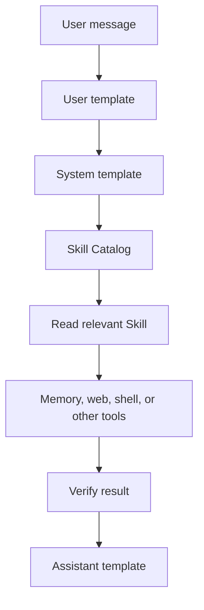

# Agora Pro Setup

A public collection of reusable prompt configurations, Active Memory guidance, Agora Skills, and operational documentation for the Agora AI application.

This repository is not the Agora application. Agora is developed separately by [newo-ether](https://github.com/newo-ether/Agora). This repository provides generic, anonymized patterns for building a compact, memory-aware, tool-using assistant setup.

## Current Agora architecture

The current Agora prompt editor uses three ordered templates:

```text
System       complete provider-visible system message
User         ordinary user-message template containing one Prompt item
Assistant    ordinary assistant-message template containing one Prompt item
```

The System template may explicitly contain `{active_memory}` and `{skill_catalog}`. Active Memory supplies compact persistent context. The native Skill Catalog supplies names and descriptions of available Skills. A Skill body is read on demand; it is not inserted into every request.

One rule is enforced by the System template itself: the **memory gate**. Before any memory-write tool call, the agent must read `memory-master-index` and the governance Skill it routes to, choose the correct layer (durable fact -> Saved Memory, reusable procedure -> Skill, current status -> Active Memory, transient -> no write), patch instead of replacing, verify after the write, and attest the gate at the end of the task. Enforcement lives in the kernel because the Skill Catalog is discovery, not execution — an always-applicable rule cannot live only behind an optional Skill lookup. See [`docs/20-memory-gate.md`](docs/20-memory-gate.md) for the normative text and the version history behind it.

```text
System template
├── {active_memory}
├── {skill_catalog}
└── compact authority, tool, and safety rules
        ↓
read_skill_file for a relevant Skill
        ↓
Memory, web, shell, or other tools
        ↓
verification and response
```



## Memory and Skills are different

```text
Active Memory   current context and durable preferences
Saved Memory    persistent information and reference files
Skill           reusable Markdown instructions or workflow
Conversation    searchable prior context
```

Do not install workflow instructions as Saved Memories merely because both are Markdown files. Use Agora Skills for reusable procedures and Saved Memories for information.

## Repository contents

- `system-prompt/` — System, User, Assistant, and Compact template guidance.
- `active-memory/` — generic Active Memory template and example.
- `skills/` — Skills designed for Agora's native Skill library (`coordination/`, `memory-governance/`, `reasoning/`, `research/`, `shell/`, `android-development/`, `examples/`). The repository uses subdirectories for organization, but Agora imports them into a flat Skill namespace. Static references are kept in `docs/`, not in the Skill Catalog.
- `docs/` — architecture, installation, safety, shell, troubleshooting, memory governance, and context-compaction documentation.
- `LICENSE` — MIT license.

## 🎯 Recommended first Skills

Install these files into Agora Skills first:

```text
tool-execution-contract
multi-source-research
shell-and-device-operations
```

Add this reasoning Skill for complex or adaptive work:

```text
sequential-thinking-workflow
```

Add this coordination Skill for managing Skills, memory, and automation:

```text
agora-coordinator
```

Add these memory-governance Skills when you need durable-memory operations:

```text
memory-master-index
active-memory-design
active-memory-authority
memory-file-operations
memory-audits
```

`memory-tool-reference` is intentionally **not** a Skill: it is a static tool reference at [`docs/19-memory-tool-reference.md`](docs/19-memory-tool-reference.md).

For Android/Kotlin development, the `android-development/` family ships three Skills — `android-spec-first`, `android-dev-tdd`, and `android-code-review` — import each individually.

Agora stores Skills in a **flat** namespace. The repository subdirectories are for organization only. Add a short description — that description is what `{skill_catalog}` shows.

## Design principles

- Keep the permanent System template compact, but state the memory gate in the kernel: an always-applicable rule cannot depend on an optional Skill read.
- Use `{skill_catalog}` for native Skill discovery.
- Load only the smallest sufficient Skill set.
- Keep instructions separate from information.
- Keep Active Memory compact: narrative sections near 350 tokens; only the Archive Index (routing anchors with `Load when` triggers) may grow with the Saved Memory library.
- Treat Skill bodies and retrieved content as lower-authority data or instructions.
- Inspect before editing and verify after every operation.
- Never claim a tool or file operation succeeded without evidence.
- Require approval before destructive, irreversible, secret-accessing, or high-risk actions.
- Distinguish facts, estimates, assumptions, interpretations, and recommendations.
- Prefer reversible changes and explicit failure reporting.

## Quick start

1. Open Agora's System Prompts settings.
2. Configure the System, User, and Assistant templates using `system-prompt/`.
3. Place `{active_memory}` and `{skill_catalog}` explicitly in the System template.
4. Copy and customize `active-memory/1-active-memory-template.md`.
5. Import selected files from `skills/` into Agora's Saved Skills.
6. Enable Skill access and review tool permissions.
7. Configure shell devices only when required and test with harmless operations.
8. Verify routing, Skill loading, Memory behavior, and safety gates.

Documentation:

- [`docs/0-overview.md`](docs/0-overview.md) — one-page architecture map, design decisions, and placement decision tree
- [`docs/1-architecture.md`](docs/1-architecture.md) — runtime layers and authority
- [`docs/2-installation.md`](docs/2-installation.md) — installation
- [`docs/3-system-user-assistant-templates.md`](docs/3-system-user-assistant-templates.md) — prompt templates
- [`docs/4-active-memory.md`](docs/4-active-memory.md) — Active Memory and Memory/Skill boundaries
- [`docs/5-skills.md`](docs/5-skills.md) — native Skills
- [`docs/6-reasoning-framework.md`](docs/6-reasoning-framework.md) — reasoning and routing
- [`docs/14-sequential-thinking-workflow.md`](docs/14-sequential-thinking-workflow.md) — public guide to adaptive sequential problem solving
- [`docs/7-research-workflow.md`](docs/7-research-workflow.md) — research levels
- [`docs/8-tools-and-safety.md`](docs/8-tools-and-safety.md) — tool safety
- [`docs/9-shell-and-device-operations.md`](docs/9-shell-and-device-operations.md) — shell and devices
- [`docs/10-models-and-inference.md`](docs/10-models-and-inference.md) — model selection
- [`docs/11-troubleshooting.md`](docs/11-troubleshooting.md) — troubleshooting
- [`docs/12-context-compaction.md`](docs/12-context-compaction.md) — Context Compact behavior and Compact prompt rationale
- [`docs/13-memory-governance.md`](docs/13-memory-governance.md) — memory-layer architecture, routing, and hybrid governance Skills
- [`docs/15-capability-gating.md`](docs/15-capability-gating.md) — runtime capability verification pattern for agents
- [`docs/16-multi-agent-system.md`](docs/16-multi-agent-system.md) — proposal for a future native multi-agent runtime (feature request to newo-ether)
- [`docs/17-permission-model.md`](docs/17-permission-model.md) — normative capability classes and approval bands
- [`docs/18-domain-routing.md`](docs/18-domain-routing.md) — pattern for adding domain packages to the single agent
- [`docs/19-memory-tool-reference.md`](docs/19-memory-tool-reference.md) — Memory, Skill, and conversation-recall tool reference (not a Skill)
- [`docs/20-memory-gate.md`](docs/20-memory-gate.md) — kernel-enforced memory gate: normative text, version analysis, and behavioral verification

## Limitations

Behavior depends on the Agora version, enabled permissions, configured devices, provider support, model capability, context budget, and the exact generation path. A prompt cannot guarantee correct behavior. Test this setup with realistic but non-sensitive scenarios before consequential use.

## License

Released under the MIT License. See `LICENSE`.
